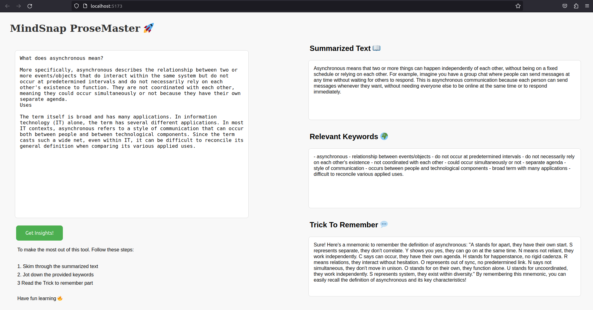

# Sample React AI Text Summarization and Analysis

## MindSnap-Prosemaster

Transform long texts into quick brilliance. Get summaries, essential keywords, and fun mnemonics in a snap! Learning made simple and engaging. For this, I have used Gemini Api key. I fetch the queries via a simple react interface. These queries are passed through the controllers to the api. Finally, the response is parsed and shown in the screen. This simple project is used as a reference to show the power of daytona.

## 🚀 Getting Started  
The hassle free way to get started is by installing and running the code in daytona container. For this you need to follow the steps below.

### Before getting to it, let me answer Why use Daytona?
- Well for starters, a single command called daytona create can start a configured development environment
- Integrates IDE like VS code locally and ready to use
- Now, the most important poinst if it works on my machine, daytona ensures that it will work on yours!

### Open Using Daytona  

1. **Install Daytona**: Follow the [Daytona installation guide](https://www.daytona.io/docs/installation/installation/).  

2. **Create the Workspace**:  
   ```bash  
   daytona create https://github.com/Ujj1225/MindSnap-ProseMaster-daytona.git 
   ```  

3. **Add gemini ai api key**:
   In the client folder, there is a .env file where you'll need to provide gemini api key

4. **Steps to Start the application**:
   Navigate to client side by: 

   ```bash
   cd client
   npm run dev
   ```

## ✨ Features  

- **Summarizer**: Condenses lengthy texts into concise, digestible summaries.
- **Keyword Whiz**: Extracts and defines essential keywords for easy understanding.
- **Memory Lane**: Crafts mnemonic stories for quick and enjoyable information retention.

## Demo

